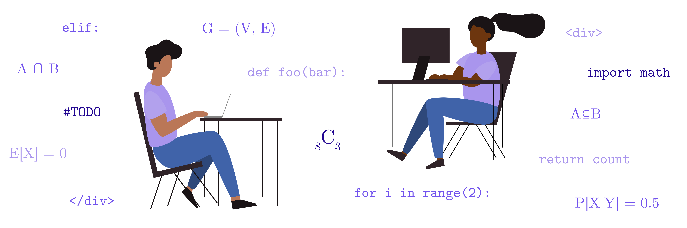

{: .mb-2 }

  


  {{ site.title }}

{: .fs-6 .fw-300 }

 
    redefine  
 an introductory computer science summer program for high schoolers 
  

<!-- 
{{ site.announcements.last }}
 -->

 

## Program Description
**redefine** is a free summer program targeted at high schoolers, specifically rising sophomores and juniors, but all years are welcome. Motivated by a vision of a more equitable and ethical tech industry, we seek to encourage more high schoolers to enter the space feeling confident and prepared, especially those students who may have never considered it before.

Despite the numerous innovations, high-growth startups, and venture-capital boom we have witnessed over the past few decades, the computer science community remains [very homogenous](https://www.wired.com/story/five-years-tech-diversity-reports-little-progress/). However, here at **redefine** we are hopeful that this cycle can be broken by exposing students to technical tools and theoretical concepts at a younger age and by embracing diversity in the field earlier on.

We believe in the power of *personalized* education as a meaningful way to sustainably impact learning and personal development. The **redefine** program will always use live instruction and encourage community-building through group-work whenever possible. Moreover, instruction will be supplemented by guest-speakers and talks that will highlight how computer science permeates many industries.

For more information about [the program](program) and [the staff](staff), check out the links on the left.
